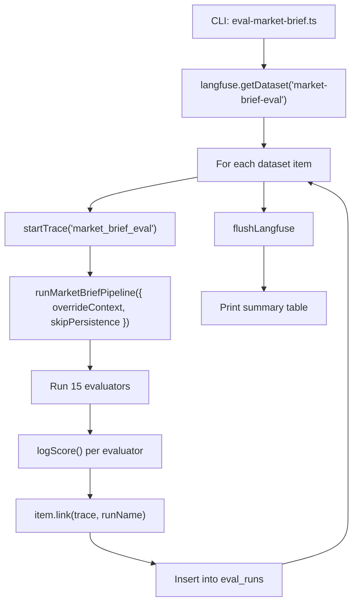

# Market Brief Eval Layer -- Feature Specification

## Goal

Add a Langfuse experiments-based eval/debug layer for the Market Brief multi-agent pipeline. The system creates datasets of market scenarios, runs the pipeline against them, applies quality evaluators, and tracks results in Langfuse for comparison over time.

This enables:
- Regression testing when prompts, models, or pipeline logic change
- Side-by-side experiment comparison in the Langfuse UI
- Quantitative quality metrics per scenario and per run

## Architecture Decision: SDK

Uses the existing `langfuse` v3 SDK (`^3.38.6`) dataset API (`createDataset`, `createDatasetItem`, `getDataset`, `item.link()`). No new dependencies beyond `tsx` (devDependency for CLI scripts). Dataset runs appear in the Langfuse Experiments UI natively.

This feature package does not include a dedicated automated test task. The eval layer is documented and operated as a CLI- and Langfuse-driven workflow, and any future automated coverage should be defined separately once the repository test strategy for non-UI evaluation code is standardized.

## Code Structure

```
src/ai/eval/
  market-brief/
    types.ts             -- dataset item types (input, expectedOutput, metadata, EvalScore)
    fixtures.ts          -- 6 curated market scenario fixtures
    dataset.ts           -- Langfuse dataset management (create, seed, fetch, snapshot)
    evaluators.ts        -- 15 evaluator functions + run-level aggregates
    experiment.ts        -- experiment runner (loop dataset, run pipeline, evaluate, link)
scripts/
  eval-market-brief.ts   -- CLI entry point (seed / run commands)
```

## Pipeline Override

`runMarketBriefPipeline()` in `src/ai/workflows/market-brief-graph.ts` accepts optional `PipelineOptions`:

```typescript
export interface PipelineOptions {
  overrideContext?: {
    snapshots: SnapshotRow[];
    news: NewsRow[];
    narratives: NarrativeRow[];
  };
  skipPersistence?: boolean;
}
```

- `overrideContext` -- injects dataset item context, bypasses DB
- `skipPersistence` -- prevents writes to `market_briefs` and `ai_runs`
- Trace is named `market_brief_eval` (not `market_brief_pipeline`) during eval

## Dataset Item Shape

### Input

```typescript
interface MarketBriefDatasetInput {
  snapshots: SnapshotRow[];
  news: NewsRow[];
  narratives: NarrativeRow[];
}
```

### Expected Output

```typescript
interface MarketBriefExpectedOutput {
  mustMention: string[];
  mustNotClaim: string[];
  expectedDrivers: string[];
  requiredRisks: string[];
  expectedNarratives: string[];
  expectedTone: "bullish" | "bearish" | "neutral" | "cautious" | "mixed";
  minConfidence: number;
  targetAssets: string[];
}
```

### Metadata

```typescript
interface MarketBriefDatasetMetadata {
  scenario: string;
  description: string;
  maxNewsAgeHours: number;
  missingAgents: string[];
}
```

## Evaluators

### Structural (always run)

| Evaluator | Scoring | Description |
|-----------|---------|-------------|
| `schemaValidity` | 0/1 | Zod parse on SynthesizedBriefSchema |
| `structuralCompleteness` | 0-1 | Summary length, driver/risk counts, sources present |
| `noDuplication` | 0/1 | Pairwise similarity on drivers and risks |
| `sourceAttribution` | 0-1 | Fraction of sources matching input news titles |
| `unsupportedClaims` | 0-1 | Penalizes unsupported sources, asset mentions, and claim phrases |

### ExpectedOutput-driven

| Evaluator | Scoring | Field |
|-----------|---------|-------|
| `mentionPresence` | 0-1 | `mustMention` |
| `negativeClaim` | 0/1 | `mustNotClaim` |
| `driverCoverage` | 0-1 | `expectedDrivers` |
| `riskCoverage` | 0-1 | `requiredRisks` |
| `narrativeCoverage` | 0-1 | `expectedNarratives` |
| `toneMatch` | 0/1 | `expectedTone` |
| `confidenceThreshold` | 0/1 | `minConfidence` |
| `assetCoverage` | 0-1 | `targetAssets` |

### Metadata-driven

| Evaluator | Scoring | Field |
|-----------|---------|-------|
| `stalenessAwareness` | 0/1 | `maxNewsAgeHours` |
| `gracefulDegradation` | 0/1 | `missingAgents` |

### Run-level aggregates

- `avgScore` -- mean of all item averages
- `worstCase` -- minimum item average (weakest scenario)

## Experiment Runner Flow



## Langfuse UI

After experiments run:
- **Datasets tab**: `market-brief-eval` dataset with scenario items
- **Dataset runs**: Named runs (e.g., `baseline-v1`, `new-prompts-v2`) with comparison
- **Per-item traces**: Full pipeline traces with agent spans
- **Scores**: All 15 evaluator scores per trace, aggregated in run view

## CLI Usage

```bash
npx tsx scripts/eval-market-brief.ts seed          # seed fixtures
npx tsx scripts/eval-market-brief.ts run --name "baseline-v1"
npx tsx scripts/eval-market-brief.ts run --name "prompt-v2" --concurrency 2
```

## Current Delivery Status

- Dataset item types, fixtures, dataset helpers, evaluators, experiment runner, CLI entry point, and package wiring are implemented
- The feature package intentionally excludes a dedicated E2E / Playwright task because the eval layer has no browser UI surface
- Any future automated coverage for evaluator logic or CLI behavior should be tracked as a separate follow-up item, not as part of this base feature definition

## Fixtures (6 scenarios)

1. **bull-full-context** -- record ETF inflows, rate cut expectations, full coverage
2. **bear-selloff** -- SEC enforcement, cascading liquidations, negative sentiment
3. **mixed-signals** -- CPI uncertainty, whale accumulation vs declining VC funding
4. **missing-news** -- no news items, tests graceful degradation
5. **stale-data** -- all news 48+ hours old, tests staleness awareness
6. **minimal-context** -- only BTC snapshot, no news/narratives, extreme edge case

## Related Files

- Pipeline: `src/ai/workflows/market-brief-graph.ts`
- Agent types: `src/ai/agents/types.ts`
- Langfuse client: `src/lib/langfuse.ts`
- DB types: `src/types/database.ts` (EvalRun, EvalRunInsert)
- DB schema: `supabase/migrations/20250309000001_initial_schema.sql` (eval_runs table)
- Market Brief playbook: `docs/features/multi_agent_market_brief_feature_playbook.md`
