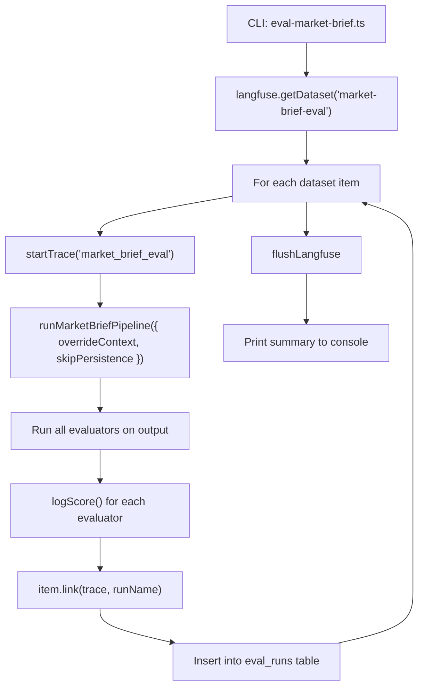

# Market Brief Eval Layer with Langfuse Experiments

> Add a Langfuse experiments-based eval/debug layer for the Market Brief pipeline.
> The system will create datasets of market scenarios, run the multi-agent pipeline
> against them, apply quality evaluators, and track results in Langfuse for comparison
> over time.

## Current State

- The project uses `langfuse` v3 (`^3.38.6`) for tracing with a singleton client in `src/lib/langfuse.ts`
- The multi-agent pipeline is in `src/ai/workflows/market-brief-graph.ts` with 6 agents orchestrated via LangGraph
- An `eval_runs` table exists in the DB but has **no application code** using it
- Types `EvalRun` / `EvalRunInsert` exist in `src/types/database.ts`

## Architecture Decision: SDK Choice

The Langfuse v3 SDK already supports datasets natively (`createDataset`, `createDatasetItem`, `getDataset`, `item.link()`). This avoids adding `@langfuse/client` v4 + OpenTelemetry -- keeping the eval layer consistent with existing tracing code. Dataset runs created this way still appear in the Langfuse Experiments UI for comparison.

## File Structure

```
src/ai/eval/
  market-brief/
    dataset.ts           -- create & seed dataset items in Langfuse
    evaluators.ts        -- all evaluator functions (deterministic + LLM-as-judge)
    experiment.ts        -- experiment runner (loop dataset, run pipeline, evaluate, link)
    fixtures.ts          -- curated market scenario fixtures
scripts/
  eval-market-brief.ts   -- CLI entry point (run via tsx)
```

## Key Design: Pipeline Override for Eval

The current `runMarketBriefPipeline()` always loads context from the DB via `loadContextFromDb()`. For eval, we need to inject dataset item context directly. Add an optional `overrideContext` parameter:

```typescript
// In market-brief-graph.ts
export interface PipelineOptions {
  overrideContext?: {
    snapshots: SnapshotRow[];
    news: NewsRow[];
    narratives: NarrativeRow[];
  };
  skipPersistence?: boolean;  // don't write to market_briefs/ai_runs during eval
}

export async function runMarketBriefPipeline(
  options?: PipelineOptions
): Promise<MarketBriefPipelineResult> { ... }
```

The `loadContextNode` will check for `overrideContext` and skip the DB call when provided. `skipPersistence` prevents eval runs from polluting the production `market_briefs` table.

## Dataset Design

Each dataset item has three layers: **input** (what the pipeline receives), **expectedOutput** (assertions on what the brief should contain), and **metadata** (scenario conditions for contextual evaluators).

### Input (pipeline context)

```typescript
interface MarketBriefDatasetInput {
  snapshots: SnapshotRow[];
  news: NewsRow[];
  narratives: NarrativeRow[];
}
```

### Expected Output (brief assertions)

```typescript
interface MarketBriefExpectedOutput {
  // Content correctness
  mustMention: string[];          // terms that MUST appear in market_summary
  mustNotClaim: string[];         // claims that must NOT appear anywhere in the brief
  expectedDrivers: string[];      // drivers that should be in output.drivers[]
  requiredRisks: string[];        // risks that should be in output.risks[]
  expectedNarratives: string[];   // narratives expected to surface in the summary

  // Tone & confidence
  expectedTone: "bullish" | "bearish" | "neutral" | "cautious" | "mixed";
  minConfidence: number;          // minimum acceptable confidence score (0-1)

  // Coverage
  targetAssets: string[];         // assets that must be discussed (e.g., ["BTC", "ETH"])
}
```

### Metadata (scenario conditions)

```typescript
interface MarketBriefDatasetMetadata {
  scenario: string;               // e.g. "bull-full-context", "bear-missing-news"
  description: string;            // human-readable scenario description
  maxNewsAgeHours: number;        // input freshness (used by staleness evaluator)
  missingAgents: string[];        // which agents are expected to fail/be empty (e.g. ["news"])
}
```

### Field-to-evaluator mapping

| Field | Evaluator | Description |
|-------|-----------|-------------|
| `mustMention` | `mentionPresenceEvaluator` | checks `market_summary` for required terms |
| `mustNotClaim` | `negativeClaimEvaluator` | scans summary + drivers + risks for forbidden claims |
| `expectedDrivers` | `driverCoverageEvaluator` | semantic overlap with `output.drivers[]` |
| `requiredRisks` | `riskCoverageEvaluator` | semantic overlap with `output.risks[]` |
| `expectedNarratives` | `narrativeCoverageEvaluator` | checks if narratives surface in summary |
| `expectedTone` | `toneMatchEvaluator` | classifies output tone, compares to expected |
| `minConfidence` | `confidenceThresholdEvaluator` | `output.confidence >= minConfidence` |
| `targetAssets` | `assetCoverageEvaluator` | checks assets are mentioned in summary/drivers |
| `maxNewsAgeHours` | `stalenessAwarenessEvaluator` | brief should note stale data or lower confidence |
| `missingAgents` | `gracefulDegradationEvaluator` | brief handles missing agents without hallucinating |

### Dataset sources (in order of implementation)

1. **Curated fixtures** -- hand-craft 5-8 scenarios (bull, bear, mixed, partial data, empty news, etc.) in `fixtures.ts`
2. **From past runs** -- a helper that reads recent `market_briefs.debug_json` and creates dataset items from the actual context used
3. **Live snapshot** -- capture current DB state as a new dataset item (for regression testing)

## Evaluators

All evaluators return `{ name: string, score: number, comment?: string }` and are logged as Langfuse scores on the trace. They receive the pipeline output, the dataset item's `expectedOutput`, and `metadata`.

### Structural evaluators (always run, no expectedOutput needed)

- `schemaValidity` -- Zod parse succeeds on `SynthesizedBriefSchema` (0 or 1)
- `structuralCompleteness` -- non-empty summary, drivers 3-6 items, risks 3-5 items, sources present (0-1 weighted)
- `noDuplication` -- pairwise similarity check on drivers and risks (1 = no dupes)
- `sourceAttribution` -- fraction of `brief.sources` that match input `news[].title` (0-1)

### ExpectedOutput-driven evaluators (use dataset item assertions)

- `mentionPresence` -- checks each `mustMention` term appears in `market_summary` (fraction found, 0-1)
- `negativeClaim` -- checks NO `mustNotClaim` terms appear in summary/drivers/risks (1 = clean, 0 = violation found)
- `driverCoverage` -- fraction of `expectedDrivers` semantically matched in `output.drivers[]` (0-1)
- `riskCoverage` -- fraction of `requiredRisks` semantically matched in `output.risks[]` (0-1)
- `narrativeCoverage` -- fraction of `expectedNarratives` that surface in summary/drivers (0-1)
- `toneMatch` -- classifies output tone (keyword heuristic), compares to `expectedTone` (0 or 1)
- `confidenceThreshold` -- `output.confidence >= minConfidence` (0 or 1)
- `assetCoverage` -- fraction of `targetAssets` mentioned in summary or drivers (0-1)

### Metadata-driven evaluators (use scenario conditions)

- `stalenessAwareness` -- if `maxNewsAgeHours` indicates stale news, checks brief acknowledges it or lowers confidence (0 or 1)
- `gracefulDegradation` -- if `missingAgents` lists agents, verifies brief doesn't hallucinate data for those domains and notes reduced coverage (0 or 1)

### Aggregate (run-level) evaluators

- `avgScore` -- average across all item-level evaluator scores for the full run
- `worstCase` -- minimum score across all items (identifies weakest scenario)

### LLM-as-judge evaluator (optional, phase 2)

- `summaryQuality` -- an LLM rates the summary for coherence, specificity, and actionability (0-1)

## Experiment Runner Flow



The experiment runner:

1. Fetches the dataset from Langfuse
2. For each item, runs the pipeline with injected context (no DB reads, no persistence)
3. Runs all evaluators and logs scores to the Langfuse trace
4. Links the trace to the dataset item under a named run (e.g., `"v1.0-gpt4o-2026-04-11"`)
5. Inserts a row into the local `eval_runs` table with aggregated metrics
6. Prints a formatted summary table to the console

## CLI Script

```bash
# Seed the dataset (first time or to add items)
npx tsx scripts/eval-market-brief.ts seed

# Run an experiment
npx tsx scripts/eval-market-brief.ts run --name "baseline-v1"

# Run with a specific dataset version
npx tsx scripts/eval-market-brief.ts run --name "prompt-v2" --concurrency 2
```

Add a `package.json` script:

```json
"eval:market-brief": "tsx scripts/eval-market-brief.ts"
```

## Dependencies

- `tsx` (devDependency) -- already used for `scripts/verify-token-chart.mjs`, but need to add as explicit devDependency for TypeScript scripts

## Changes to Existing Files

- `src/ai/workflows/market-brief-graph.ts`: Add `PipelineOptions` parameter with `overrideContext` and `skipPersistence`
- `package.json`: Add `tsx` devDependency, add `eval:market-brief` script
- `src/lib/langfuse.ts`: Export `getLangfuse()` (already exported) -- no changes needed

## What Shows Up in Langfuse

After running experiments:

- **Datasets tab**: `market-brief-eval` dataset with all scenario items
- **Dataset runs**: Each experiment run (e.g., `baseline-v1`, `prompt-v2`) as a separate run with comparison view
- **Per-item traces**: Full pipeline traces with agent spans, linked to dataset items
- **Scores**: All evaluator scores visible on each trace and aggregated in the dataset run view
- This enables side-by-side comparison when changing prompts, models, or pipeline logic

## Testing

Per project rules, add a Playwright test in `tests/e2e/eval-market-brief.spec.ts` that verifies the eval API endpoint (if exposed) or the eval script runs without errors. Alternatively, since this is a CLI-only feature, add a basic integration test that validates evaluator functions against fixture data.

## Implementation Order

1. Add `overrideContext` and `skipPersistence` to `runMarketBriefPipeline` in `market-brief-graph.ts`
2. Create curated market scenario fixtures in `src/ai/eval/market-brief/fixtures.ts`
3. Create dataset management module in `src/ai/eval/market-brief/dataset.ts`
4. Implement all evaluators in `src/ai/eval/market-brief/evaluators.ts`
5. Build experiment runner in `src/ai/eval/market-brief/experiment.ts`
6. Create CLI entry point `scripts/eval-market-brief.ts`
7. Add `tsx` devDependency and `eval:market-brief` script to `package.json`
8. Add Playwright test for evaluator functions against fixture data
